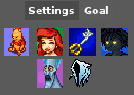
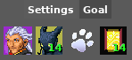
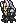
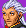

# Kingdom Hearts Final Mix AP Tracker
This is a [PopTracker](https://github.com/black-sliver/PopTracker/) Pack for Kingdom Hearts Final Mix to be used for the multiworld randomizer [Archipelago](https://archipelago.gg/).

## Settings Tabs
### Settings
The settings are divided into two tabs. The first one shows the following settings:

- **Pooh** and **Ariel** respectively indicate whether checks in the **Hundred Acre Wood** and **Atlantica** are included
- An activated **keyblade** indicates that world-specific keyblades are needed to open chests
- **Anti Sora** is the toggle for **Advanced Logic**

These four settings are all loaded automatically when connecting the tracker to the AP server. Advanced Logic can be toggled on even if it was not considered when creating the multiworld. It then shows the checks that can be ontained OoL.

**Hades** and the **Phantom** silhouette indicate wheter checks for **Cups** and **Superbosses** are included. These settings are currently not tracked automatically and therefore need to be adjusted *manually*. If you randomized these settings or are playing a mystery YAML, you can search for the cup and superboss checks in the multiworld tracker. If they are not listed, then these settings are off.

### Goal
The Goal tab contains four tiles indicating from left to right the **goal**, the **report requirements** to gain access to the **End of the World**, the requirement to open the **Final Rest Door** and the **reports required** to open said **door**:

The maximum amount of reports that can be obtain in the game are 13, so if the second and/or fourth tile shows 14 reports as requirement, this indicates, that the reports are not needed to gain access to the End of the World or the Final Rest Door. In these cases the End of the World is unlocked by obtaining the identically named world item and the Final Rest Door is unlocked by whatever is shown in the third tile.

The possible **Goals** are:
- Defeat Sephiroth 
- Defeat Unknown 
- Send all 10 Postcards 
- Defeat Final Ansem 
- Rescue all 99 Puppies  and
- Reach the Final Rest 

Similarly, the **Final Rest Door** can be opened by:
- Collecting Reports 
- Rescuing all 99 Puppies 
- Sending all 10 Postcards  or
- Defeating all Superbosses 

These settings are all tracked automatically and will be loaded once conencted to the AP server.

## Known Issues
Currently story events like rescuing Gepetto and Pinocchio from Monstro or saving Kairi in Hollow Bastion are tracked by assessing whether the corresponding checks (here defeating Parasite Cage II or Riku II) have been collected. This can cause issues with multiworlds where collect is turned on. In these cases it can happen that the tracker shows checks as available, because the checks of the aformentioned story events have been automatically collected, when the player did not actively collect them.

## Feedback
Feedback is always apreciated. If there is an issue with the tracker, either open an issue here on github or contact me via Discord.

## Credits
Icons were made by [Televo](https://github.com/Televo/kingdom-hearts-recollection) or taken from CoM rips by [GaryCXJk](https://www.spriters-resource.com/submitter/GaryCXJk/).